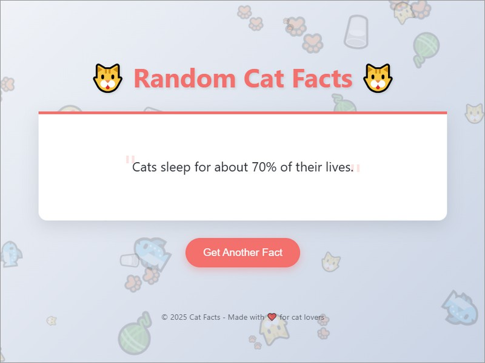

# Cat Facts Project

This project consists of a Django-based API that serves random cat facts, and a scraper using Selenium to extract the cat fact from the website.<br>


## Project Structure

The project is organized as follows:

cat_facts/<br>├── cat_facts/<br>&nbsp;&nbsp;&nbsp;&nbsp;&nbsp;&nbsp;&nbsp;&nbsp;├── init.py<br>&nbsp;&nbsp;&nbsp;&nbsp;&nbsp;&nbsp;&nbsp;&nbsp;├── settings.py<br>&nbsp;&nbsp;&nbsp;&nbsp;&nbsp;&nbsp;&nbsp;&nbsp;├── urls.py<br>&nbsp;&nbsp;&nbsp;&nbsp;&nbsp;&nbsp;&nbsp;&nbsp;├── wsgi.py<br>├── api/<br>&nbsp;&nbsp;&nbsp;&nbsp;&nbsp;&nbsp;&nbsp;&nbsp;├── init.py<br>&nbsp;&nbsp;&nbsp;&nbsp;&nbsp;&nbsp;&nbsp;&nbsp;├── admin.py<br>&nbsp;&nbsp;&nbsp;&nbsp;&nbsp;&nbsp;&nbsp;&nbsp;├── apps.py<br>&nbsp;&nbsp;&nbsp;&nbsp;&nbsp;&nbsp;&nbsp;&nbsp;├── migrations/<br>&nbsp;&nbsp;&nbsp;&nbsp;&nbsp;&nbsp;&nbsp;&nbsp;├── models.py<br>&nbsp;&nbsp;&nbsp;&nbsp;&nbsp;&nbsp;&nbsp;&nbsp;├── templates/<br>&nbsp;&nbsp;&nbsp;&nbsp;&nbsp;&nbsp;&nbsp;&nbsp;&nbsp;&nbsp;&nbsp;&nbsp;&nbsp;&nbsp;&nbsp;&nbsp;└── home.html<br>&nbsp;&nbsp;&nbsp;&nbsp;&nbsp;&nbsp;&nbsp;&nbsp;├── tests.py<br>&nbsp;&nbsp;&nbsp;&nbsp;&nbsp;&nbsp;&nbsp;&nbsp;├── urls.py<br>&nbsp;&nbsp;&nbsp;&nbsp;&nbsp;&nbsp;&nbsp;&nbsp;└── views.py<br>├── manage.py<br>├── db.sqlite3<br>├── run_server.bat<br>└── scrapper/<br>&nbsp;&nbsp;&nbsp;&nbsp;&nbsp;&nbsp;&nbsp;&nbsp;└── main.py<br>


### **Key Files:**
- **`cat_facts/`**: The main Django project directory.
  - **`settings.py`**: Configuration for the Django project.
  - **`urls.py`**: Main URL routing for the project.
- **`api/`**: The Django app for serving cat facts.
  - **`views.py`**: Contains the logic for serving the cat facts API and the home page.
  - **`templates/home.html`**: Template for the home page that displays a random cat fact.
  - **`urls.py`**: URL routing for the API app.
- **`scrapper/main.py`**: The Selenium scraper that extracts a random cat fact from the running Django app.
- **`run_server.bat`**: Batch file to run the Django server easily on Windows.
- **`.gitignore`**: List of files and directories to ignore in version control (like Python bytecode files and virtual environments).

---

## Requirements

- **Python 3.x** (preferably Python 3.7 or higher)
- **Django** (to run the web server and API)
- **Selenium** (for the scraper)
- **ChromeDriver** (to run the scraper with Chrome) *optional
  
### Install Required Python Packages

1. First, create a virtual environment (recommended):

   ```bash
   python -m venv .env
   ```
   <b>NOTE: In order for ```run_server.bat``` to work later on, please stick to ```.env``` name.<b>
2. Activate the virtual environment:
    * On Windows:
        ```bash
        .env\Scripts\activate
        ```
    * On macOS/Linux:
        ```bash
        source .env/bin/activate

        ```
3. Install required packages:
    ```bash
    pip install -r requirements.txt
    ```
## Running the Django Server

To run the Django development server, you can either use the following command or the included `run_server.bat` batch file.

### Using `run_server.bat` (Recommended)

1. Double-click the `run_server.bat` file to automatically start the server. This will:
   - Navigate to your project directory
   - Activate the virtual environment (if used)
   - Start the Django development server

   The server will be available at: `http://localhost:8000`.

### Manually Using Django's `runserver` Command

If you prefer running it manually, use the following command:

```bash
python manage.py runserver
```

This will start the Django server and make it accessible at `http://localhost:8000`.

## Accessing the API

Once the server is running, you can visit the following endpoints:

- **`/fact/`**: Returns a random cat fact in JSON format. Example: `{"fact": "Cats sleep for about 70% of their lives."}`
  
- **`/home/`**: Displays a simple HTML page with a random cat fact.

## Using the Scraper

The scraper uses **Selenium** to navigate to the `/home` endpoint and extract the random cat fact.

### Steps to Run the Scraper:

1. Ensure the Django server is running (`python manage.py runserver` or use `run_server.bat`).
2. Run the scraper script:

   ```bash
   python scrapper/main.py
   ```

   This will:
   - Launch a Chrome browser using Selenium.
   - Navigate to the `/home` page of your Django app.
   - Extract the cat fact displayed on the page.
   - Print the extracted cat fact to the console.

## License

This project is licensed under the MIT

LicenseCopyright 2025 - Mostafa MO Mostafa

Permission is hereby granted, free of charge, to any person obtaining a copy of this software and associated documentation files (the “Software”), to deal in the Software without restriction, including without limitation the rights to use, copy, modify, merge, publish, distribute, sublicense, and/or sell copies of the Software, and to permit persons to whom the Software is furnished to do so, subject to the following conditions:

The above copyright notice and this permission notice shall be included in all copies or substantial portions of the Software.

THE SOFTWARE IS PROVIDED “AS IS”, WITHOUT WARRANTY OF ANY KIND, EXPRESS OR IMPLIED, INCLUDING BUT NOT LIMITED TO THE WARRANTIES OF MERCHANTABILITY, FITNESS FOR A PARTICULAR PURPOSE AND NONINFRINGEMENT. IN NO EVENT SHALL THE AUTHORS OR COPYRIGHT HOLDERS BE LIABLE FOR ANY CLAIM, DAMAGES OR OTHER LIABILITY, WHETHER IN AN ACTION OF CONTRACT, TORT OR OTHERWISE, ARISING FROM, OUT OF OR IN CONNECTION WITH THE SOFTWARE OR THE USE OR OTHER DEALINGS IN THE SOFTWARE.
